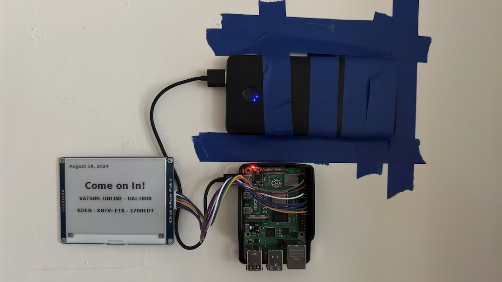

# Room Display Sign

## Description
I wanted to create a small sign for my door in my apartment to let my roomates know if they could come in or not. I use it to set the status of what I am currently doing, whether that be a meeting, playing a video game, or napping. 

### Sign

### HTML Interface

### What I Used
1. Python
    1. Flask
    2. RPi.GPIO
2. Waveshare EPD